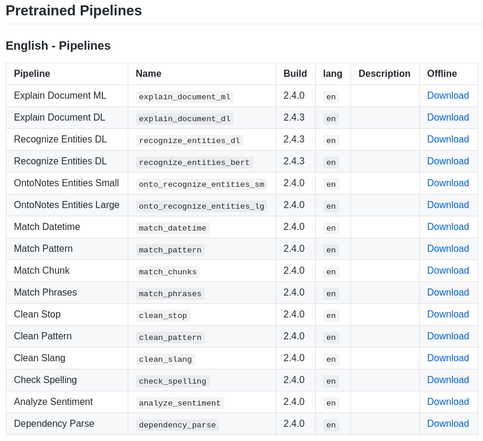

# 1. Start Spark Session

```{r}
library(purrr)
library(sparklyr)
library(sparknlp)
library(dplyr)

version <- Sys.getenv("SPARK_VERSION", unset = "2.4.3")

config <- sparklyr::spark_config()

options(sparklyr.sanitize.column.names.verbose = TRUE)
options(sparklyr.verbose = TRUE)
options(sparklyr.na.omit.verbose = TRUE)
options(sparklyr.na.action.verbose = TRUE)
    
sc <- sparklyr::spark_connect(master = "local", version = version, config = config)

cat("Apache Spark version: ", sc$home_version, "\n")
cat("Spark NLP version: ", nlp_version())
```

# 2. Using Pretrained Pipelines
https://github.com/JohnSnowLabs/spark-nlp-models


```{r}
testDoc <- "Peter is a very good persn.
My life in Russia is very intersting.
John and Peter are brothrs. However they don't support each other that much.
Lucas Nogal Dunbercker is no longer happy. He has a good car though.
Europe is very culture rich. There are huge churches! and big houses!"
```

## Explain Document ML
### Stages
* DocumentAssembler
* SentenceDetector
* Tokenizer
* Stemmer
* Part of Speech
* SpellChecker (Norvig)

```{r}
pipeline <- nlp_pretrained_pipeline(sc, "explain_document_ml", lang = "en")
```

```{r}
system.time(
  result <- nlp_annotate(pipeline, testDoc)
)
```

```{r}
names(result)
```

```{r}
result$sentence %>% unlist()
```

```{r}
result$token %>% unlist()
```

```{r}
data.frame(token = unlist(result$token), pos = unlist(result$pos))
```

```{r}
data.frame(token = unlist(result$token), lemmas = unlist(result$lemmas), stems = unlist(result$stems), spell = unlist(result$spell))
```

## Explain Document DL
### Stages
* DocumentAssembler
* SentenceDetector
* Tokenizer
* NER (NER with GloVe, CoNLL2003 dataset)
* Lemmatizer
* Stemmer
* Part of Speech
* SpellChecker (Norvig)

```{r}
pipeline_dl <- nlp_pretrained_pipeline(sc, "explain_document_dl", lang = "en")
```

```{r}
system.time(
  result <- nlp_annotate(pipeline_dl, testDoc)
)
```
```{r}
names(result)
```

```{r}
result$entities %>% unlist()
```

```{r}
data.frame(token = unlist(result$token), ner_label = unlist(result$ner), spell_corrected = unlist(result$checked),
           POS = unlist(result$pos), lemmas = unlist(result$lemma), stems = unlist(result$stem))
```

## Spell Checker
```{r}
spell_checker <- nlp_pretrained_pipeline(sc, "check_spelling", lang = "en")
```

```{r}
result <- nlp_annotate(spell_checker, testDoc)

names(result)
```
```{r}
data.frame(token = unlist(result$token), checked = unlist(result$checked))
```

## Parsing a list of texts
```{r}
testDoc_list <- c('French author who helped pioner the science-fiction genre.',
'Verne wrate about space, air, and underwater travel before navigable aircrast',
'Practical submarines were invented, and before any means of space travel had been devised.')

testDoc_list
```
```{r}
result_list <- nlp_annotate(pipeline, testDoc_list)

length(result_list)
```

```{r}
result_list[[1]]
```
# Using fullAnnotate to get more details
```{r}
text <- 'Peter Parker is a nice guy and lives in New York'
```

```{r}
detailed_result <- nlp_annotate_full(pipeline_dl, text)
```

```{r}
jsonlite::toJSON(detailed_result, force = TRUE, auto_unbox = TRUE)
```

```{r}
detailed_result$entities
```

```{r}
chunks <- purrr::map_chr(detailed_result$entities, "result")
entities <- purrr::map_chr(detailed_result$entities, function(x) x$metadata$entity)

df <- data.frame(chunks = chunks, entities = entities)
df
```

```{r}
sent_ids <- map_chr(detailed_result$token, function(x) x$metadata$sentence)
tokens <- map_chr(detailed_result$token, "result")
starts <- map_chr(detailed_result$token, "begin")
ends <- map_chr(detailed_result$token, "end")
pos <- map_chr(detailed_result$pos, "result")
ner <- map_chr(detailed_result$ner, "result")

df <- data.frame(sent_id = sent_ids, token = tokens, start = starts, end = ends, pos = pos, ner = ner)
df
```

## Use pretrained match_chunk Pipeline for Individual Noun Phrase
### Stages
* DocumentAssembler
* SentenceDetector
* Tokenizer
* Part of Speech
* Chunker

Pipeline:
* The pipeline uses regex `<DT>?<JJ>*<NN>+`
* which states that whenever the chunk finds an optional determiner (DT) followed by any number of adjectives (JJ) and then a noun (NN) then the Noun Phrase(NP) chunk should be formed.
```{r}
pipeline <- nlp_pretrained_pipeline(sc, "match_chunks", lang = "en")
```
```{r}
result <- nlp_annotate(pipeline, "The book has many chapters") # single noun phrase
```
```{r}
map(result, unlist)
```
```{r}
result$chunk
```
```{r}
result <- nlp_annotate(pipeline, "the little yellow dog barked at the cat") # Multiple noun phrases
```

```{r}
map(result, unlist)
```
```{r}
unlist(result$chunk)
```

## Extract exact dates from referential date phrases
```{r}
pipeline <- nlp_pretrained_pipeline(sc, "match_datetime", lang = "en")
```

```{r}
result <- nlp_annotate(pipeline, "I saw him yesterday and he told me that he will visit us next week")
map(result, unlist)
```
```{r}
full_result <- nlp_annotate_full(pipeline, "I saw him yesterday and he told me that he will visit us next week")
jsonlite::toJSON(full_result, force = TRUE, auto_unbox = TRUE)
```

## Sentiment Analysis
```{r}
pipeline <- nlp_pretrained_pipeline(sc, "analyze_sentiment", lang = "en")
```

```{r}
result <- nlp_annotate(pipeline, "The movie I watched today was not a good one")
unlist(result$sentiment)
```


