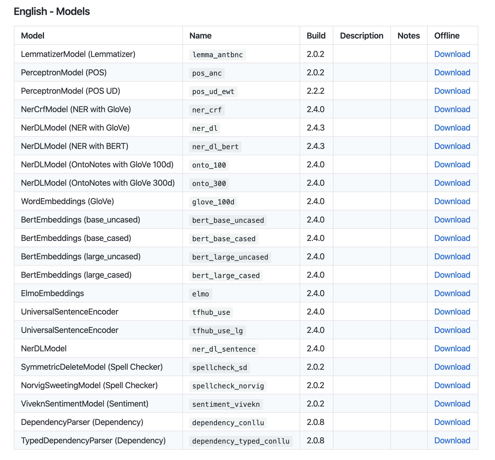
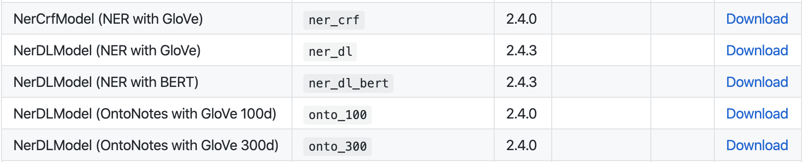

This notebook is adapted from John Snow Labs workshop Jupyter/Python tutorial "3.SparkNLP_Pretrained_Models"
(https://github.com/JohnSnowLabs/spark-nlp-workshop/blob/master/tutorials/Certification_Trainings/Public/3.SparkNLP_Pretrained_Models.ipynb)

Spark NLP offers the following pre-trained models in five languages (English, French, German, Italian, Russia) and all you need to do is to load the pre-trained model into your disk by specifying the model name and then configuring the model parameters as per your use case and dataset. Then you will not need to worry about training a new model from scratch and will be able to enjoy the pre-trained SOTA algorithms directly applied to your own data with transform().

In the official documentation, you can find detailed information regarding how these models are trained by using which algorithms and datasets.

https://github.com/JohnSnowLabs/spark-nlp-models



# LemmatizerModel
```{r}
news_category_test <- pins::pin("https://s3.amazonaws.com/auxdata.johnsnowlabs.com/public/resources/en/classifier-dl/news_Category/news_category_test.csv")
```

```{r}
library(purrr, warn.conflicts = FALSE)
library(sparklyr, warn.conflicts = FALSE)
library(sparknlp, warn.conflicts = FALSE)
library(dplyr, warn.conflicts = FALSE)

version <- Sys.getenv("SPARK_VERSION", unset = "2.4.5")

config <- sparklyr::spark_config()
config$`sparklyr.shell.driver-memory` <- "8g"

options(sparklyr.sanitize.column.names.verbose = TRUE)
options(sparklyr.verbose = TRUE)
options(sparklyr.na.omit.verbose = TRUE)
options(sparklyr.na.action.verbose = TRUE)
    
sc <- sparklyr::spark_connect(master = "local", version = version, config = config)

cat("Apache Spark version: ", sc$home_version, "\n")
cat("Spark NLP version: ", nlp_version())
```
```{r}
news_df <- spark_read_csv(sc, news_category_test) %>% 
  rename(text = description)

head(news_df %>% mutate(text = substr(text, 1, 50)), 20)
```
```{r}
lemmatizer <- nlp_lemmatizer_pretrained(sc, name = "lemma_antbnc", input_cols = c("token"), output_col = "lemma",)
```

```{r}
file.info(list.files("~/cache_pretrained", full.names = TRUE)) %>% 
  select(mode, uname, grname, mtime)
```
```{r}
documentAssembler <- nlp_document_assembler(sc, input_col = "text", output_col = "document")
tokenizer <- nlp_tokenizer(sc, input_cols = c("document"), output_col = "token")
stemmer <- nlp_stemmer(sc, input_cols = c("token"), output_col = "stem")

nlpPipeline <- ml_pipeline(documentAssembler, tokenizer, stemmer, lemmatizer)

empty_df <- sdf_copy_to(sc, data.frame(text = ""))

pipelineModel <- ml_fit(nlpPipeline, empty_df)
```

```{r}
result <- ml_transform(pipelineModel, news_df)

head(
  result %>% 
    mutate(text = substr(text, 1, 50),
           document = substr(to_json(document), 1, 30),
           token = substr(to_json(token), 1, 30),
           stem = substr(to_json(stem), 1, 30),
           lemma = substr(to_json(lemma), 1, 30))
  
  
  , 5)
```
```{r}
result %>% 
  mutate(token_result = substr(to_json(token.result), 1, 50), lemma_result = substr(to_json(lemma.result), 1, 50)) %>% 
  select(token_result, lemma_result) %>% 
  head(5)
```
# PerceptronModel (POS - Part of speech tags)
```{r}
pos <- nlp_perceptron_pretrained(sc, name = "pos_anc", input_cols = c("document", "token"), output_col = "pos")
```

```{r}
file.info(list.files("~/cache_pretrained", full.names = TRUE)) %>% 
  select(mode, uname, grname, mtime)
```

```{r}
nlpPipeline <- ml_pipeline(documentAssembler,
                           tokenizer,
                           stemmer,
                           lemmatizer,
                           pos)

empty_df <- sdf_copy_to(sc, data.frame(text = ""))

pipelineModel <- ml_fit(nlpPipeline, empty_df)
```

```{r}
result <- ml_transform(pipelineModel, news_df)

head(
  result %>% 
    mutate(text = substr(text, 1, 50),
           document = substr(to_json(document), 1, 30),
           token = substr(to_json(token), 1, 30),
           stem = substr(to_json(stem), 1, 30),
           lemma = substr(to_json(lemma), 1, 30),
           pos = substr(to_json(pos), 1, 30))
  
  
  , 5)
```

```{r}
result %>%
  mutate(token_result = substr(to_json(token.result), 1, 50),
         pos_result = substr(to_json(pos.result), 1, 50)) %>% 
  select(token_result, pos_result) %>% 
  head(5)
```

```{r}
# applying this pipeline to top 100 rows and then converting to local data frame

result <- ml_transform(pipelineModel, head(news_df, 100))

result_df <- result %>% 
  mutate(cols = explode(arrays_zip(token.result, token.begin, token.end, stem.result, lemma.result, pos.result))) %>%
  select(cols) %>% 
  sdf_separate_column(column = "cols", into = c("token", "begin", "end", "stem", "lemma", "pos")) %>% 
  select(-cols) %>%
  collect()

head(result_df, 10)
```
```{r}
# same in LightPipeline

light_model <- nlp_light_pipeline(pipelineModel)

light_result <- nlp_annotate(light_model, 'Unions representing workers at Turner   Newall say they are disappointed after talks with stricken parent firm Federal Mogul.')

data.frame(token = unlist(light_result$token),
           stem = unlist(light_result$stem),
           lemma = unlist(light_result$lemma),
           pos = unlist(light_result$pos))
```
```{r}
# applying POS chunker to find a custom pattern

chunker <- nlp_chunker(sc, input_cols = c("document", "pos"), output_col = "chunk", regex_parsers = c("<NNP>+", "<DT>?<JJ>*<NN>"))

# NNP: Proper Noun
# NN: COmmon Noun
# DT: Determinator (e.g. the)
# JJ: Adjective

nlpPipeline <- ml_pipeline(documentAssembler,
                           tokenizer,
                           stemmer,
                           lemmatizer,
                           pos,
                           chunker)

empty_df <- sdf_copy_to(sc, data.frame(text = ""))

pipelineModel <- ml_fit(nlpPipeline, empty_df)
```

```{r}
result <- ml_transform(pipelineModel, head(news_df, 100))

head(
  result %>% 
    mutate(text = substr(text, 1, 50),
           document = substr(to_json(document), 1, 30),
           token = substr(to_json(token), 1, 30),
           stem = substr(to_json(stem), 1, 30),
           lemma = substr(to_json(lemma), 1, 30),
           pos = substr(to_json(pos), 1, 30),
           chunk = substr(to_json(chunk), 1, 30))
  , 5)
```
```{r}
result_df <- result %>% 
  mutate(cols = explode(arrays_zip(chunk.result, chunk.begin, chunk.end))) %>% 
  select(cols) %>% 
  sdf_separate_column(column = "cols", into = c("chunk", "begin", "end")) %>% 
  select(-cols) %>% 
  collect()

head(result_df, 10)
```
# Dependency Parser
```{r}
dep_parser <- nlp_dependency_parser_pretrained(sc, name = "dependency_conllu", 
                                               input_cols = c("document", "pos", "token"), output_col = "dependency")
```

```{r}
typed_dep_parser <- nlp_typed_dependency_parser_pretrained(sc, name = "dependency_typed_conllu",
                                                           input_cols = c("token", "pos", "dependency"), output_col = "dependency_type")
```

```{r}
nlpPipeline <- ml_pipeline(documentAssembler,
                           tokenizer,
                           stemmer,
                           lemmatizer,
                           pos,
                           dep_parser,
                           typed_dep_parser)

empty_df <- sdf_copy_to(sc, data.frame(text = ""))

pipelineModel <- ml_fit(nlpPipeline, empty_df)
```

```{r}
result <- ml_transform(pipelineModel, head(news_df, 100))

result_df <- result %>% 
  mutate(cols = explode(arrays_zip(token.result, token.begin, token.end, dependency.result, dependency_type.result))) %>% 
  select(cols) %>% 
  sdf_separate_column(column = "cols", into = c("chunk", "begin", "end", "dependency", "dependency_type")) %>% 
  select(-cols) %>% 
  collect()

head(result_df, 10)
```

# SpellChecker
```{r}
spell_checker <- nlp_norvig_spell_checker_pretrained(sc, name = "spellcheck_norvig", input_cols = c("token"), output_col = "corrected")
```

```{r}
nlpPipeline <- ml_pipeline(documentAssembler,
                           tokenizer,
                           stemmer,
                           lemmatizer,
                           pos,
                           spell_checker)

empty_df <- sdf_copy_to(sc, data.frame(text = ""))

pipelineModel <- ml_fit(nlpPipeline, empty_df)
```

```{r}
result <- ml_transform(pipelineModel, head(news_df, 100))
```

```{r}
result_df <- result %>% 
  mutate(cols = explode(arrays_zip(token.result, corrected.result, stem.result, lemma.result, pos.result))) %>% 
  select(cols) %>% 
  sdf_separate_column(column = "cols", into = c("token", "corrected", "stem", "lemma", "pos")) %>% 
  select(-cols) %>% 
  collect()

head(result_df, 10)
```
```{r}
# same in LightPipeline

light_model <- nlp_light_pipeline(pipelineModel)

light_result <- nlp_annotate(light_model, "The patint has pain and headache")

data.frame(token = unlist(light_result$token), corrected = unlist(light_result$corrected))
```

# Word Embeddings (Glove)
```{r}
glove_embeddings <- nlp_word_embeddings_pretrained(sc, name = "glove_100d", 
                                                   input_cols = c("document", "token"), output_col = "embeddings")
```

```{r}
nlpPipeline <- ml_pipeline(documentAssembler,
                           tokenizer,
                           glove_embeddings)

empty_df <- sdf_copy_to(sc, data.frame(text = ""))

pipelineModel <- ml_fit(nlpPipeline, empty_df)
```

```{r}
result <- ml_transform(pipelineModel, head(news_df, 10))
```

```{r}
result %>% mutate(embeddings = to_json(embeddings.embeddings)) %>% 
  select(embeddings) %>% 
  head(1)
```

```{r}
result_df <- result %>% 
  mutate(cols = explode(arrays_zip(token.result, embeddings.embeddings))) %>% 
  select(cols) %>% 
  sdf_separate_column(column = "cols", into = c("token", "embeddings")) %>% 
  select(-cols)

head(result_df, 10)
```

# Elmo Embeddings
```{r}
elmo_embeddings <- nlp_elmo_embeddings_pretrained(sc, name = "elmo", input_cols = c("document", "token"), output_col = "embeddings")
```

```{r}
nlpPipeline <- ml_pipeline(documentAssembler,
                           tokenizer,
                           elmo_embeddings)

empty_df <- sdf_copy_to(sc, data.frame(text = ""))

pipelineModel <- ml_fit(nlpPipeline, empty_df)

result <- ml_transform(pipelineModel, head(news_df, 10))

result_df <- result %>% 
  mutate(cols = explode(arrays_zip(token.result, embeddings.embeddings))) %>% 
  select(cols) %>% 
  sdf_separate_column(column = "cols", into = c("token", "elmo_embeddings")) %>% 
  select(-cols)

head(result_df, 10)
```

# Bert Embeddings
```{r}
bert_embeddings <- nlp_bert_embeddings_pretrained(sc, name = "bert_base_uncased", input_cols = c("document", "token"), output_col = "embeddings")
```

```{r}
nlpPipeline <- ml_pipeline(documentAssembler,
                           tokenizer,
                           bert_embeddings)

empty_df <- sdf_copy_to(sc, data.frame(text = ""))

pipelineModel <- ml_fit(nlpPipeline, empty_df)

result <- ml_transform(pipelineModel, head(news_df, 10))

result_df <- result %>% 
  mutate(cols = explode(arrays_zip(token.result, embeddings.embeddings))) %>% 
  select(cols) %>% 
  sdf_separate_column(column = "cols", into = c("token", "bert_embeddings")) %>% 
  select(-cols)

head(result_df, 10)
```

# UniversalSentenceEncoder
```{r}
use_embeddings <- nlp_univ_sent_encoder_pretrained(sc, name = "tfhub_use", input_cols = c("document"), output_col = "sentence_embeddings")
```

```{r}
nlpPipeline <- ml_pipeline(documentAssembler,
                           use_embeddings)

empty_df <- sdf_copy_to(sc, data.frame(text = ""))

pipelineModel <- ml_fit(nlpPipeline, empty_df)

result <- ml_transform(pipelineModel, head(news_df, 10))

result_df <- result %>% 
  mutate(cols = explode(arrays_zip(document.result, sentence_embeddings.embeddings))) %>% 
  select(cols) %>% 
  sdf_separate_column(column = "cols", into = c("document", "USE_embeddings")) %>% 
  select(-cols)

head(result_df, 10)
```

## Loading models from local
```{r}
list.files("~/cache_pretrained/", full.names = TRUE)
```
```{r}
glove_embeddings <- ml_load(sc, "/home/davek/cache_pretrained//glove_100d_en_2.4.0_2.4_1579690104032")

nlp_set_input_cols(glove_embeddings, c("document", "token"))
nlp_set_output_col(glove_embeddings, "glove_embeddings")
```

## Using your own Word embeddings in Spark NLP
```{r}
custom_embeddings <- nlp_word_embeddings(sc, input_cols = c("sentence", "token"), output_col = "my_embeddings",
                                         storage_path = "PubMed-shuffle-win-2.bin", storage_path_format = "BINARY",
                                         dimension = 200)
```

## Getting Sentence Embeddings from Glove, Elmo and BERT
```{r}
glove_embeddings <- nlp_word_embeddings_pretrained(sc, name = "glove_100d", input_cols = c("document", "token"), output_col = "embeddings")

embeddingSentence <- nlp_sentence_embeddings(sc, input_cols = c("document", "embeddings"), 
                                             output_col = "sentence_embeddings", pooling_strategy = "AVERAGE")

nlpPipeline <- ml_pipeline(documentAssembler,
                           tokenizer,
                           glove_embeddings,
                           embeddingSentence)

empty_df <- sdf_copy_to(sc, data.frame(text = ""))

pipelineModel <- ml_fit(nlpPipeline, empty_df)

result <- ml_transform(pipelineModel, head(news_df, 10))

result_df <- result %>% 
  mutate(cols = explode(arrays_zip(document.result, sentence_embeddings.embeddings))) %>% 
  select(cols) %>% 
  sdf_separate_column(column = "cols", into = c("document", "sentence_embeddings")) %>% 
  select(-cols)

head(result_df, 10)
```


```{r}
cosine_dist <- function(x, y) {
  1 - (x %*% y / sqrt(x %*% x * y %*% y))
}

embeddings <- result_df %>%
  select(sentence_embeddings) %>% 
  head(2) %>% 
  collect()

v1 <- embeddings$sentence_embeddings[[1]]
v2 <- embeddings$sentence_embeddings[[2]]

1 - cosine_dist(v1, v2)[1,1]
```
```{r}
v2 <- embeddings$sentence_embeddings[[1]]

1- - cosine_dist(v1, v2)[1,1]
```

# NERDL Model

## Public NER (CoNLL 2003)
Entities

`PERSON, LOCATION, ORGANIZATION, MISC`

```{r}
public_ner <- nlp_ner_dl_pretrained(sc, name = "ner_dl", input_cols = c("document", "token", "embeddings"), output_col = "ner")
```

```{r}
documentAssembler <- nlp_document_assembler(sc, input_col = "text", output_col = "document")

tokenizer <- nlp_tokenizer(sc, input_cols = c("document"), output_col = "token")

# ner_dl model is trained with glove_100d. So we use the same embeddings in the pipeline
glove_embeddings <- nlp_word_embeddings_pretrained(sc, name = "glove_100d", 
                                                   input_cols = c("document", "token"), output_col = "embeddings")

nlpPipeline <- ml_pipeline(documentAssembler,
                           tokenizer,
                           glove_embeddings,
                           public_ner)

empty_df <- sdf_copy_to(sc, data.frame(text = ""))

pipelineModel <- ml_fit(nlpPipeline, empty_df)
```

```{r}
result <- ml_transform(pipelineModel, head(news_df, 10))

result_df <- result %>% 
  mutate(cols = explode(arrays_zip(token.result, ner.result))) %>% 
  sdf_separate_column(column = "cols", into = c("tokens", "ner_label")) %>% 
  select(tokens, ner_label)

head(result_df, 50)
```

## NerDL OntoNotes 100D
Entities

`'CARDINAL', 'DATE', 'EVENT', 'FAC', 'GPE', 'LANGUAGE', 'LAW', 'LOC', 'MONEY', 'NORP', 'ORDINAL', 'ORG', 'PERCENT', 'PERSON', 'PRODUCT', 'QUANTITY', 'TIME', 'WORK_OF_ART'`

```{r}
onto_ner <- nlp_ner_dl_pretrained(sc, name = "onto_100", input_cols = c("document", "token", "embeddings"), output_col = "ner")

nlpPipeline <- ml_pipeline(documentAssembler,
                           tokenizer,
                           glove_embeddings,
                           onto_ner)

empty_df <- sdf_copy_to(sc, data.frame(text = ""))

pipelineModel <- ml_fit(nlpPipeline, empty_df)
```

```{r}
result <- ml_transform(pipelineModel, head(news_df, 10))

result_df <- result %>% 
  mutate(cols = explode(arrays_zip(token.result, ner.result))) %>% 
  sdf_separate_column(column = "cols", into = c("tokens", "ner_label")) %>% 
  select(tokens, ner_label)

head(result_df, 50)
```

## Getting the NER chunks with NER Converter
```{r}
ner_converter <- nlp_ner_converter(sc, input_cols = c("document", "token", "ner"), output_col = "ner_chunk")

nlpPipeline <- ml_pipeline(documentAssembler,
                           tokenizer,
                           glove_embeddings,
                           onto_ner,
                           ner_converter)

empty_df <- sdf_copy_to(sc, data.frame(text = ""))

pipelineModel <- ml_fit(nlpPipeline, empty_df)

result <- ml_transform(pipelineModel, head(news_df, 10))
```

```{r}
result_df <- result %>% 
  mutate(cols = explode(arrays_zip(ner_chunk.result, ner_chunk.metadata))) %>% 
  sdf_separate_column(column = "cols", into = c("chunk", "ner_label")) %>% 
  mutate(ner_label = ner_label.entity) %>% 
  select(chunk, ner_label)

head(result_df, 50)
```
```{r}
#fullAnnotate in LightPipeline

light_model <- nlp_light_pipeline(pipelineModel)

light_result <- nlp_annotate_full(light_model, 'Unions representing workers at Turner Newall say they are disappointed after talks with stricken parent firm Federal Mogul and Mike Fitzpatrick in Canada.')

chunks <- map_chr(light_result$ner_chunk, "result")
entities <- map_chr(light_result$ner_chunk, function(x) x$metadata$entity)

data.frame(chunks = chunks, entities = entities)
```


